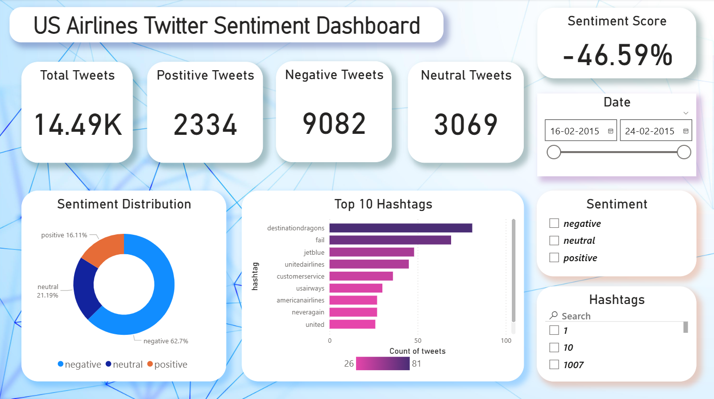
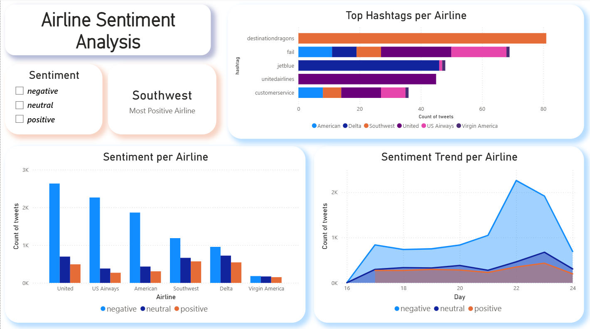

# ✈️ US Airlines Twitter Sentiment Analysis Dashboard  

## 📌 Project Overview  
This project analyzes **14,000+ tweets** about major US airlines over a 7-day period (Feb 16–24, 2015).  
Tweets were manually labeled as **positive, neutral, or negative**.  

The goal was to build an **interactive Power BI dashboard** to:  
- Track **customer sentiment** toward US airlines  
- Compare **airline performance** based on social media feedback  
- Identify **top complaints, trends, and improvement areas**  

---

## 🗂️ Dataset  
- **Source**: [Twitter US Airline Sentiment Dataset (Kaggle)](https://www.kaggle.com/datasets/crowdflower/twitter-airline-sentiment)  
- **Total Tweets**: ~14.5K  
- **Duration**: 7 days (Feb 16–24, 2015)  

**Sentiment Distribution:**  
- Negative → ~63%  
- Neutral → ~21%  
- Positive → ~16%  

---

## 📊 Dashboard Pages  

### **Page 1: US Airlines Twitter Sentiment Dashboard**  
  

- **KPIs**: Total Tweets, Positive, Negative, Neutral, Sentiment Score  
- **Donut Chart**: Sentiment Distribution  
- **Top Hashtags**: Trending topics like `#fail`, `#customerservice`, `#neveragain`  
- **Filters**: Date, Sentiment, Hashtags  

**Business Questions Answered:**  
- What’s the overall sentiment of US airline passengers?  
- Which hashtags show top customer issues?  
- On which days were customers most vocal?  

---

### **Page 2: Airline Sentiment Analysis**  
  

- **Sentiment per Airline**: Compare positive, neutral, and negative tweets  
- **Most Positive Airline**: Southwest shows the best sentiment balance  
- **Top Hashtags per Airline**: Issues tied to each airline  
- **Sentiment Trend per Airline**: Daily sentiment trends to detect service disruptions  

**Business Questions Answered:**  
- Which airline has the best/worst sentiment?  
- How does customer feedback vary between airlines?  
- Are there spikes in negativity linked to events (e.g., Feb 22 surge)?  

---

## 📈 Key Insights  
- **63% of tweets are negative** → strong dissatisfaction among passengers  
- **Service-related hashtags dominate** → delays, cancellations, poor support  
- **Southwest** has the most positive sentiment → potential best practices  
- **United & US Airways** face the most negative feedback  
- **Feb 22 spike in negativity** → possible industry-wide disruption  

---

## 🚀 Value of the Dashboard  
- **Airlines** → Identify pain points, benchmark competitors, improve service  
- **Recruiters** → Shows **data cleaning, DAX, visualization, and storytelling** skills  
- **Data Scientists** → Real-world example of **sentiment analysis + BI integration**  

---

## 🛠️ Tools Used  
- **Power BI** → Dashboard design & DAX  
- **Dataset** → Kaggle: Twitter US Airline Sentiment  
- **Techniques** → Sentiment scoring, KPI design, time-series analysis, hashtag analysis  
